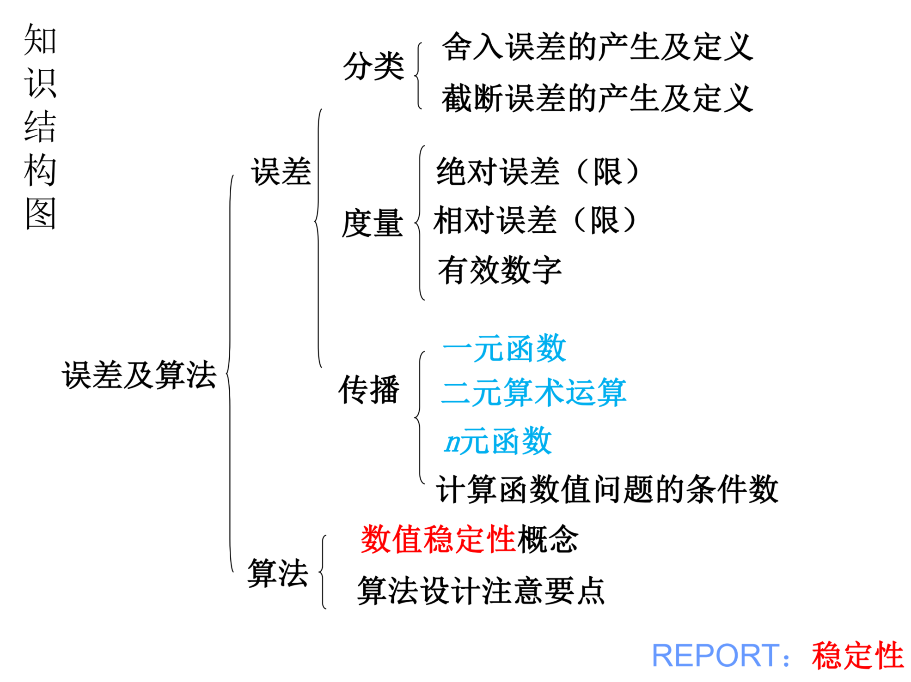
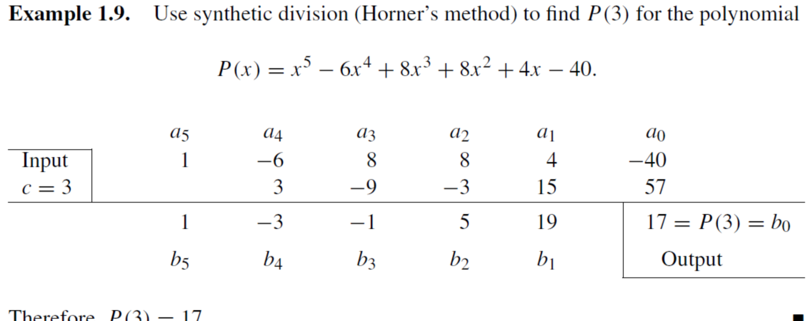

# 高等数值计算第一章复习
每一章，包括一些公式都给整理下来便于记忆。复习完这一遍之后就可以去整理一个公式纸了。

## 知识结构图

## 舍入误差以及截断误差

- 模型误差：数学模式与实际问题之间出现的误差
- 观测误差：观测者主观测量中受到的不可预料的随机干扰等影响
- 截断误差：使用数值方法求近似解替代，这种简化带入的误差。（例如对于f(x)用泰勒展开式近似代替，则数值方法的截断误差是泰勒余项）
- 舍入误差：计算机只能处理有限数位的小数运算，初始参数或中间结果都必须进行四舍五入计算，产生舍入误差

## 绝对/相对误差 & 有效数字

假设$p$为准确值，$\hat{p}$为近似值，则：

绝对误差：$E_{p}=|p-\hat{p}|$

相对误差：$E_{p}=|\frac{p-\hat{p}}{p}|$

误差限：$|p-\hat{p}|\le\epsilon$

相对误差限（相对误差的绝对值上限）：$\epsilon_r = \frac{\epsilon}{|p|}$

有效数字：如果近似值$x$的误差限是某一位的半个单位，该位到$x$的第一位非零数字共有$n$位，则说$x$有$n$位有效数字。

例1：写出五位有效数字的数：

187.9325 -> 187.93      8.000033 -> 8.00

 例2：判断下面几个数字的有效数字

1.1021：五位    56.430：五位    0.031：两位

## 误差定性分析以及危害

病态问题：对一个数值问题本身如果输入数据有微小扰动，引起输出数据相对误差很大，则为病态问题。

条件数：计算函数值$f(x)$时，若$x$有扰动$\Delta x=x-\hat{x}$，其相对误差为$\frac{\Delta x}{x}$，而函数值的相对误差为：$\frac{f(x)-f(\hat{x})}{f(x)}$

故，利用$f(\hat{x})\approx f(x)+f'(x)(\hat{x}-x)$，相对误差的比值如下：
$$
|\frac{f(x)-f(\hat{x})}{f(x)}|/|\frac{\Delta x}{x}|\approx |\frac{xf'(x)}{f(x)}|=C_p
$$
其中$C_p$则为计算函数值问题的**条件数**， $C_p\ge10$就是病态，$C_p$越大病态越严重

避免误差危害的原则：

1. 避免除数绝对值远小于被除数绝对值的除法

2. 避免两临近数相减：

   例1： $\sqrt{x+1}-\sqrt{x}$在x远远大于1时可以改为$\frac{1}{\sqrt{x+1}-\sqrt{x}}$

   例2：$1-cosx$在x的绝对值远远小于1时可以改为$2sin^2(\frac{x}{2})$

3. 防止大数吃掉小数：数字特别大的时候，再加小数会被浮点数吃掉，要把小数相加成大数再求和

4. 简化运算步骤，减少运算次数（在算法上减少他的计算次数）

## 秦九韶算法 / Horner算法

只要清楚这个图就好：

